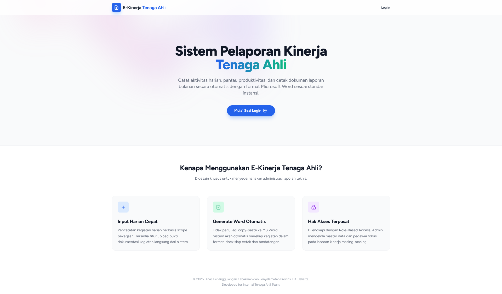
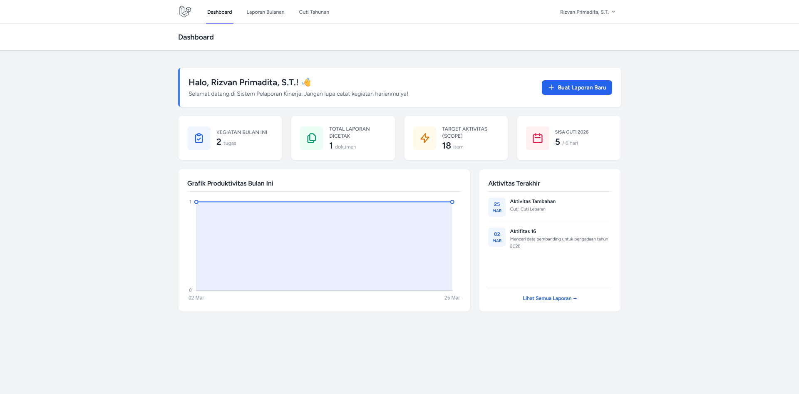
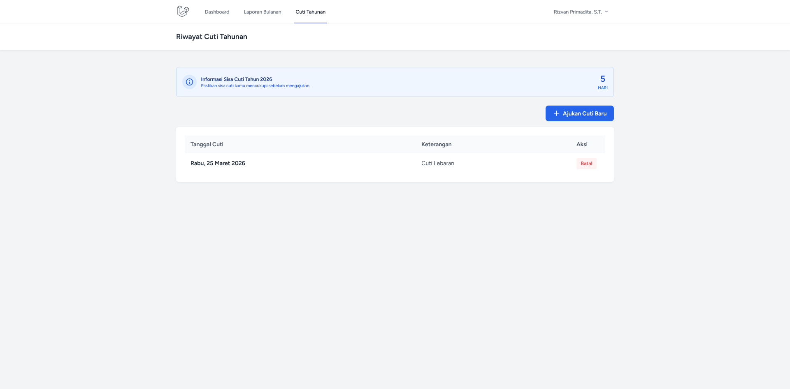
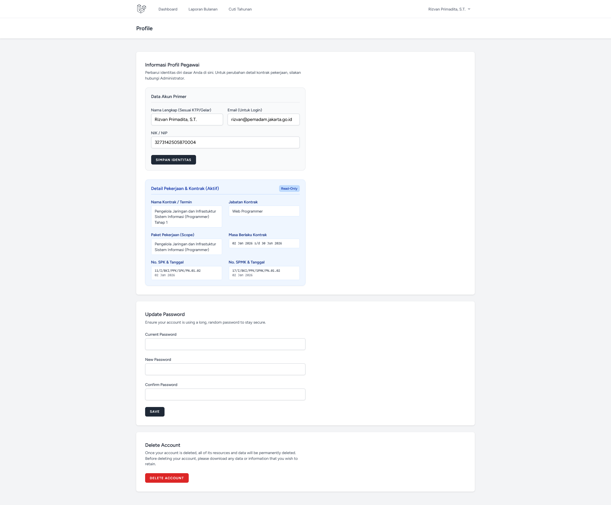
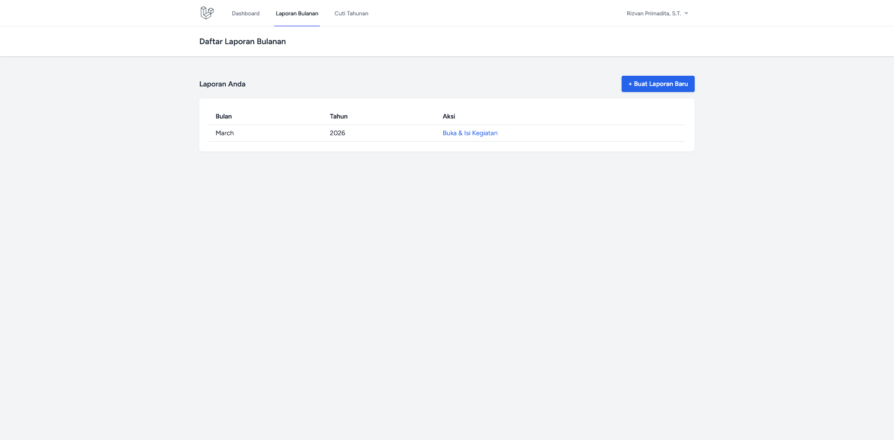

# eLTA - elektronik Laporan Tenaga Ahli

Sistem pelaporan kinerja harian tenaga ahli Disgulkarmat Provinsi DKI Jakarta.


## Deskripsi

**eLTA - elektronik Laporan Tenaga Ahli** adalah aplikasi yang digunakan untuk mengelola:

- Pencatatan kegiatan harian
- Manajemen kontrak kerja
- Pengajuan dan perhitungan cuti
- Generate laporan bulanan Microsoft Word (`.docx`)

## Fitur Utama

- Auto-generate laporan Word lengkap dengan data aktivitas
- Role-based access (`Admin` dan `Pegawai`)
- Riwayat kontrak
- Kalkulasi cuti terintegrasi dengan laporan
- Dashboard interaktif berbasis Chart.js
- UI responsif (mobile dan desktop)

## Screenshot Aplikasi

<table>
  <tr>
    <td align="center"><strong>Landing Page</strong></td>
    <td align="center"><strong>Dashboard Pegawai</strong></td>
  </tr>
  <tr>
    <td></td>
    <td></td>
  </tr>
  <tr>
    <td align="center"><strong>Halaman Cuti</strong></td>
    <td align="center"><strong>Profil Pengguna</strong></td>
  </tr>
  <tr>
    <td></td>
    <td></td>
  </tr>
  <tr>
    <td align="center"><strong>Hasil Laporan</strong></td>
    <td></td>
  </tr>
  <tr>
    <td></td>
    <td></td>
  </tr>
</table>

## Prasyarat

Pastikan environment sudah memiliki:

- PHP 8.1+
- Composer
- Node.js dan npm
- MySQL atau MariaDB

## Instalasi

1. Clone repository

```bash
git clone https://github.com/jasinfo113/laporan.git
cd laporan
```

2. Install dependensi

```bash
composer install
npm install
```

3. Setup environment

```bash
cp .env.example .env
```

Lalu atur `DB_DATABASE`, `DB_USERNAME`, dan `DB_PASSWORD` pada file `.env`.

4. Generate app key

```bash
php artisan key:generate
```

5. Migrasi dan seed database

```bash
php artisan migrate:fresh --seed
```

6. Link storage

```bash
php artisan storage:link
```

7. Build asset dan jalankan server

```bash
npm run build
php artisan serve
```

Akses aplikasi di `http://localhost:8000`.

## Akun Default

### Admin
- Email: `admin@pemadam.jakarta.go.id`
- Password: `password`

### Pegawai
- Email: `rizvan@pemadam.jakarta.go.id`
- Password: `password`

## Pengembang

**Rizvan Primadita** 

Tenaga Ahli Web Programmer - Disgulkarmat Provinsi DKI Jakarta

